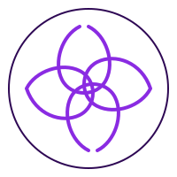

<div align="center">

# ✨ Nexus AI



### 🚀 Premium AI Chatbot with Beautiful UI/UX

[](https://reactjs.org/)
[](https://groq.com/)
[](https://nodejs.org/)
[](https://mongodb.com/)

<br/>

**A modern, premium AI chatbot featuring streaming responses, image search, PDF generation, live code preview, and a stunning amber-themed dark UI.**

[Features](#-features) • [Demo](#-demo) • [Installation](#-installation) • [Tech Stack](#-tech-stack) • [API](#-api)

---

</div>

## 🎯 Features

<table>
<tr>
<td width="50%">

### � AI Chat
- **Streaming Responses** - Real-time text streaming with fade-blur animations
- **Smart Intent Detection** - Auto-detects code, PDF, and image requests
- **Conversation Memory** - Chats persist across page refresh
- **Chat History** - Switch between previous conversations

</td>
<td width="50%">

### 🖼️ Image Search
- **Auto Image Display** - 4 Wikimedia images with every response
- **Image Modal** - Click to expand with smooth spring animation
- **Smart Keywords** - AI extracts relevant search terms
- **High Quality** - Direct from Wikimedia Commons

</td>
</tr>
<tr>
<td width="50%">

### 📄 PDF Generation
- **One-Click Export** - Generate beautiful PDFs from any response
- **Styled Documents** - Professional formatting with PDFKit
- **Pro Feature** - Available for Pro subscribers

</td>
<td width="50%">

### � Live Code Preview
- **Toggle View** - Switch between code and output
- **Multi-Language** - HTML, CSS, JavaScript support
- **Real Execution** - Run code directly in browser
- **Pro Feature** - Available for Pro subscribers

</td>
</tr>
</table>

---

## 🎨 UI/UX Highlights

<div align="center">

| Feature | Description |
|---------|-------------|
| 🌙 **Dark Theme** | Premium dark UI with amber (#fbbf24) accent colors |
| 💊 **Pill-Shaped UI** | Modern rounded elements throughout |
| ✨ **Animations** | Smooth Framer Motion transitions |
| 📱 **Responsive** | Overlay sidebar on mobile, collapsible on desktop |
| 🔒 **Pro Gating** | Feature locks with upgrade prompts |
| ⌨️ **Floating Input** | Beautiful floating input with blur gradient |

</div>

---

## 🚀 Installation

### Prerequisites

- Node.js 18+
- MongoDB (local or Atlas)
- Groq API Key

### Quick Start

```bash
# Clone the repository
git clone https://github.com/yourusername/nexus-ai.git
cd nexus-ai

# Install backend dependencies
cd backend
npm install

# Configure environment variables
cp .env.example .env
# Edit .env with your credentials

# Start backend server
npm run dev

# In a new terminal, install frontend dependencies
cd ../frontend
npm install

# Start frontend dev server
npm run dev
```

### Environment Variables

Create a `.env` file in the `backend` folder:

```env
GROQ_API_KEY=your_groq_api_key_here
MONGODB_URI=mongodb://localhost:27017/nexus_ai
JWT_SECRET=your_super_secret_jwt_key
EMAIL_USER=your_gmail@gmail.com
EMAIL_PASS=your_gmail_app_password
PORT=5000
```

---

## 🛠️ Tech Stack

<div align="center">

### Frontend

| Technology | Purpose |
|------------|---------|
|  | UI Framework |
|  | Build Tool |
|  | Animations |
|  | Icon Library |

### Backend

| Technology | Purpose |
|------------|---------|
|  | Runtime |
|  | Web Framework |
|  | Database |
|  | AI Model (Llama 3.1) |

</div>

---

## � Project Structure

```
nexus-ai/
├── 📂 backend/
│   ├── 📂 models/          # MongoDB schemas
│   ├── 📂 routes/          # API routes (auth, chat)
│   ├── 📂 services/        # Business logic
│   │   ├── groqService.js  # AI chat integration
│   │   ├── pdfService.js   # PDF generation
│   │   ├── otpService.js   # Email OTP
│   │   └── searchService.js # Wikimedia images
│   └── server.js           # Express entry point
│
├── 📂 frontend/
│   ├── 📂 public/          # Static assets
│   │   └── soul_logo.svg   # App logo
│   └── 📂 src/
│       ├── 📂 components/
│       │   ├── Auth.jsx    # OTP authentication
│       │   ├── Chat.jsx    # Main chat interface
│       │   ├── CodeBlock.jsx # Code with live preview
│       │   ├── ImageModal.jsx # Image viewer
│       │   └── Pricing.jsx # Subscription plans
│       ├── App.jsx         # Router + Auth context
│       ├── main.jsx        # React entry
│       └── index.css       # Global styles
│
└── README.md
```

---

## 🔌 API Endpoints

### Authentication

| Method | Endpoint | Description |
|--------|----------|-------------|
| `POST` | `/api/auth/request-otp` | Send OTP to email |
| `POST` | `/api/auth/verify-otp` | Verify OTP & login |
| `GET` | `/api/auth/me` | Get current user |

### Chat

| Method | Endpoint | Description |
|--------|----------|-------------|
| `POST` | `/api/chat` | Send message (non-streaming) |
| `POST` | `/api/chat/stream` | Send message (streaming) |
| `POST` | `/api/chat/ocr` | Analyze uploaded image |
| `GET` | `/api/chat/images` | Search Wikimedia images |

---

## 💳 Pro Features

| Feature | Free | Pro |
|---------|:----:|:---:|
| AI Chat | ✅ | ✅ |
| Image Search | ✅ | ✅ |
| Streaming Responses | ✅ | ✅ |
| PDF Generation | ❌ | ✅ |
| Live Code Preview | ❌ | ✅ |
| Image OCR | ❌ | ✅ |
| Priority Responses | ❌ | ✅ |

---

## 🤝 Contributing

Contributions are welcome! Please feel free to submit a Pull Request.

1. Fork the project
2. Create your feature branch (`git checkout -b feature/AmazingFeature`)
3. Commit your changes (`git commit -m 'Add some AmazingFeature'`)
4. Push to the branch (`git push origin feature/AmazingFeature`)
5. Open a Pull Request

---

## � License

This project is licensed under the MIT License - see the [LICENSE](LICENSE) file for details.

---

<div align="center">

### Made with ❤️ and ☕

**Star ⭐ this repo if you found it helpful!**

[](https://github.com/vivek3931/nexus_ai)

</div>
